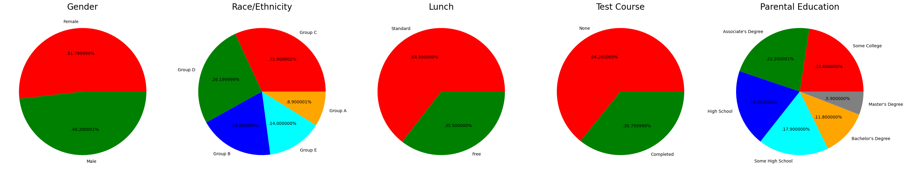

# Performance Predictor



## Project Overview

This machine learning application predicts student math scores based on various demographic and academic factors. The model analyzes how features such as gender, race/ethnicity, parental education, lunch type, and test preparation influence academic performance.

## Demo

The application is deployed on AWS Elastic Beanstalk. You can access the live demo on the deployment platform once available.

## Features

- **Predictive Analytics**: Predicts math scores based on multiple input variables
- **Interactive Web Interface**: User-friendly interface to input student data and view predictions
- **Data Visualization**: Comprehensive EDA visualizations available in the notebooks folder
- **Machine Learning Pipeline**: End-to-end ML pipeline with preprocessing, model training, and evaluation
- **FastAPI Backend**: High-performance, modern Python web framework

## Tech Stack

- **Frontend**: HTML/CSS, Jinja2 Templates
- **Backend**: FastAPI
- **Machine Learning**: Scikit-learn, CatBoost
- **Data Processing**: Pandas, NumPy
- **Visualization**: Matplotlib, Seaborn
- **Deployment**: AWS Elastic Beanstalk

## Project Structure

```text
├── app.py                  # FastAPI application entry point
├── requirements.txt        # Project dependencies
├── artifacts/              # Model artifacts (trained models, preprocessors)
│   ├── data.csv
│   ├── model.pkl
│   ├── preprocessor.pkl
│   ├── test.csv
│   └── train.csv
├── notebooks/              # Jupyter notebooks for EDA and model development
│   ├── model_training.ipynb
│   └── student_performance_eda.ipynb
├── src/                    # Source code
│   ├── components/         # Model components
│   ├── config/             # Configuration files
│   ├── pipeline/           # Training and prediction pipelines
│   ├── exception.py        # Custom exception handling
│   ├── logger.py           # Logging functionality
│   └── utils.py            # Utility functions
├── templates/              # HTML templates
│   ├── home.html           # Landing page
│   └── index.html          # Prediction form
└── .ebextensions/          # AWS Elastic Beanstalk configuration
    └── python.config
```

## Installation & Setup

1. **Clone the repository**

   ```bash
   git clone https://github.com/Abhinavexists/project-1-ml.git
   cd Project-1-ML
   ```

2. **Create a virtual environment**

   ```bash
   python -m venv venv
   source venv/bin/activate  # On Windows: venv\Scripts\activate
   ```

3. **Install dependencies**

   ```bash
   pip install -r requirements.txt
   ```

4. **Run the application**

   ```bash
   python app.py
   ```

5. **Access the application**
   Open your browser and navigate to `http://localhost:8000`

## Usage

1. Navigate to the home page
2. Click on "Try Score Prediction" to access the prediction form
3. Fill in the student details:
   - Gender
   - Race/Ethnicity
   - Parental Level of Education
   - Lunch Type
   - Test Preparation Course Status
   - Reading Score
   - Writing Score
4. Submit the form to get the predicted math score

## Model Development

The project follows these machine learning steps:

1. **Exploratory Data Analysis (EDA)** to understand feature relationships
2. **Data Preprocessing** including encoding categorical variables and scaling
3. **Model Training** with various algorithms including Linear Regression, Random Forest, and CatBoost
4. **Hyperparameter Tuning** to optimize model performance
5. **Model Evaluation** using metrics like R², MAE, MSE, and RMSE
6. **Model Persistence** for use in the prediction pipeline

## Deployment

The application is configured for AWS Elastic Beanstalk deployment:

1. Create an Elastic Beanstalk environment
2. Deploy the application using the AWS CLI or console
3. The `.ebextensions/python.config` file handles the configuration automatically

## License

This project is licensed under the [LICENSE](LICENSE) included in the repository.
